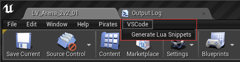

最近在做UE4的插件，想添加一个编辑器菜单按钮，在公司项目工程跑的好好的，但是回家自己建的工程不行，稍微研究了一下，整理了一下如何新加一个全新的一级菜单的最简实现以作备忘。

效果预览
-----------


LuaSnippetsGenerator.h
------------------------
```cpp
#pragma once

#include "ModuleManager.h"

class FLuaSnippetsGeneratorModule : public IModuleInterface
{
public:
	virtual void StartupModule() override;

private:
	void AddMenuBarExtension(FMenuBarBuilder& Builder);
	void FillVSCodeMenu(FMenuBuilder& Builder);
	void PluginButtonClicked();
};
```

LuaSnippetsGenerator.cpp
------------------------
```cpp
#include "LuaSnippetsGeneratorPrivatePCH.h"
#include "LuaSnippetsGenerator.h"
#include "LevelEditor.h"
#include "SlateBasics.h"
#include "EditorStyle.h"

#define LOCTEXT_NAMESPACE "FLuaSnippetsGeneratorModule"

void FLuaSnippetsGeneratorModule::StartupModule()
{
	TSharedPtr<FExtender> MenuExtender = MakeShareable(new FExtender());
	MenuExtender->AddMenuBarExtension(
		"Help",
		EExtensionHook::After,
		NULL,
		FMenuBarExtensionDelegate::CreateRaw(this, &FLuaSnippetsGeneratorModule::AddMenuBarExtension));

	FLevelEditorModule& LevelEditorModule = FModuleManager::LoadModuleChecked<FLevelEditorModule>("LevelEditor");
	LevelEditorModule.GetMenuExtensibilityManager()->AddExtender(MenuExtender);
}

void FLuaSnippetsGeneratorModule::AddMenuBarExtension(FMenuBarBuilder& Builder)
{
	Builder.AddPullDownMenu(
		FText::FromString("VSCode"),
		FText::FromString("Plugins for vscode."),
		FNewMenuDelegate::CreateRaw(this, &FLuaSnippetsGeneratorModule::FillVSCodeMenu),
		"VSCode"
	);
}

void FLuaSnippetsGeneratorModule::FillVSCodeMenu(FMenuBuilder& Builder)
{
	Builder.AddMenuEntry(
		FText::FromString("Generate Lua Snippets"),
		FText::FromString("Generate Lua Snippets for vscode."),
		FSlateIcon(),
		FUIAction(FExecuteAction::CreateRaw(this, &FLuaSnippetsGeneratorModule::PluginButtonClicked))
	);
}

void FLuaSnippetsGeneratorModule::PluginButtonClicked()
{
    // do something.
}

#undef LOCTEXT_NAMESPACE
	
IMPLEMENT_MODULE(FLuaSnippetsGeneratorModule, LuaSnippetsGenerator)
```